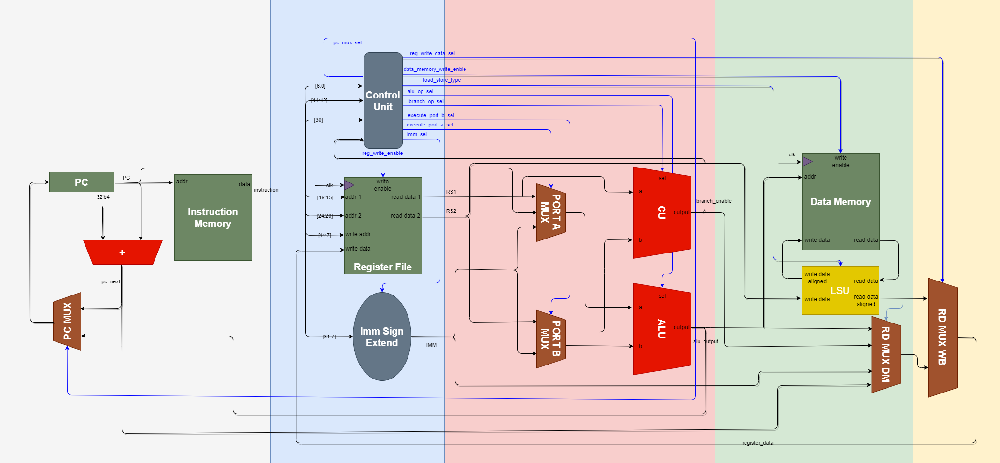

# RV32I RISC-V Processor



This repository contains the SystemVerilog implementation of two types of RV32I RISC-V processors: a single-cycle processor and a multi-cycle processor. The RV32I architecture is a 32-bit base integer instruction set architecture from the RISC-V family.

## Folder Structure

- `src`: Contains the source code for the RV32I processors.
  - `multi_cycle_processor`: Implementation of the multi-cycle processor.
  - `single_cycle_processor`: Implementation of the single-cycle processor.
  
- `tb`: Contains test benches and simulation scripts for verifying the processor's functionality.

- `doc`: Contains documentation related to the project.
  - `images`: Stores images used in the documentation.

## Features

- Support for RV32I instruction set architecture.
- Implementation of both multi-cycle and single-cycle processors.
- Written in SystemVerilog for FPGA implementations.

## Project Status

This project is currently in a hobbyist or educational stage and is designed to provide a basic understanding of RV32I RISC-V processors. It does not include advanced features such as cache or branch predictors. While there are plans to improve the design in the future, due to time constraints, the project may not be expanded to a full-fledged processor with all advanced functionalities.

## Important Note

This RV32I RISC-V processor implementation is based on an earlier version of the RISC-V ISA (Instruction Set Architecture). As a result, it may not include all the features, extensions, or instructions introduced in the latest RISC-V ISA versions.

Please be aware that if you are looking for a processor that fully supports the latest RISC-V ISA specifications, this project may not meet those requirements. However, it can still serve as a valuable educational resource and a starting point for understanding RISC-V architecture and digital design principles.

If you require a processor with the latest ISA features, we recommend exploring other projects or implementations that align with your specific needs and target ISA version.

## Getting Started

Follow these steps to get started with the RV32I RISC-V processors:

1. **Clone the Repository:**
```shell
# Download repo.
$ git clone https://github.com/HarieshAnbalagan/RV32I.git
$ cd RV32I
```

2. **Simulation and Testing:**
- Navigate to the `tb` directory for simulation scripts and testbenches.
- Use your preferred EDA tools for simulation (e.g., ModelSim).

3. **Documentation:**
- Refer to the `doc` directory for detailed documentation on the processor's architecture and design principles.

4. **Contributing:**
- If you'd like to contribute to this project, please see the [CONTRIBUTING.md](CONTRIBUTING.md) file.

## Verification

### Directed Differential Verification

Run the existing deterministic directed flow from the repository root:

```shell
python tb\regression.py
```

The flow discovers machine-code programs, uses the termination manifest, runs the V3 legacy checks where expected-result files exist, and runs V4 differential checking for supported manifest entries. The current directed differential baseline is:

```text
PASS: 16
FAIL: 0
SKIP: 0
```

Directed and randomized tests are complementary. Random tests do not replace the directed regression.

### V7 Constrained-Random Verification

[tb/random_regression.py](tb/random_regression.py) generates deterministic machine-code programs and invokes [tb/differential_check.py](tb/differential_check.py) for each temporary test. The reference model is sequential and architectural; the RTL is pipelined.

```text
        RV32I program
       |
         +---------+---------+
         v                   v
       Python reference model      RTL
         |                   |
       architectural events  retirement events
         +---------+---------+
       v
     differential checker
       |
        retirement and final state checks
```

Generated machine-code files and temporary termination entries are removed after each test. The machine-code image is authoritative for RTL execution.

### Running Random Tests

Run one generated test:

```shell
python tb\random_regression.py --seed 1000 --count 1 --length 8
```

Options:

- `--seed`: first deterministic seed; the runner increments it for each generated test.
- `--count`: number of generated tests; default is `4`.
- `--length`: number of random ALU instructions in the generated body; default is `8`.
- `--vlib`, `--vlog`, `--vsim`: optional ModelSim tool names or paths.

Reproduce a reported failure such as `seed=12345` with:

```shell
python tb\random_regression.py --seed 12345 --count 1 --length 8
```

The same generator version, seed, and generation parameters produce the same machine-code program. Reproducibility is relative to the current generator version; a future generator change may change an existing seed's output.

Run the validated bounded campaign:

```shell
python tb\random_regression.py --seed 1000 --count 100 --length 8
```

This covers seeds `1000` through `1099`. It is not exhaustive verification.

### Generated Instruction Scope

The generator emits legal encodings from the instruction classes already supported by the current model and RTL:

R-type:

- `ADD`, `SUB`, `SLL`, `SLT`, `SLTU`
- `XOR`, `SRL`, `SRA`, `OR`, `AND`

I-type ALU:

- `ADDI`, `SLTI`, `SLTIU`, `XORI`, `ORI`, `ANDI`
- `SLLI`, `SRLI`, `SRAI`

Upper immediate:

- `LUI`, `AUIPC`

Memory:

- `LW`, `SW`

Branches:

- `BEQ`, `BNE`

Jumps:

- `JAL`, `JALR`

The random body uses R-type and I-type ALU instructions. The fixed skeleton adds upper-immediate, memory, branch, and jump operations. The generator does not generate `LB`, `LH`, `LBU`, `LHU`, `SB`, or `SH`.

### Control Flow and Safety Constraints

V7 does not generate arbitrary unconstrained control flow. Branch, JAL, and JALR targets are forward and fixed within the generated image, so generated execution is loop-free and terminates through the configured architectural instruction count. JALR targets are even and remain inside the generated program.

Memory operations use direct array indices supported by the repository memory model; they do not assume standard byte-addressed memory. Register source selection is restricted to registers initialized before the instruction on the actual execution path. `x0` is always safe. This prevents a taken branch or jump from flushing the only write to a register that later code reads.

Static generated program length and dynamic architectural instruction count are different. Taken control flow can skip words, so the runner derives the dynamic count from reference-model execution and uses that count for RTL retirement termination.

### Differential Checking

For instruction-count tests, [tb/differential_check.py](tb/differential_check.py) compares each RTL retirement event with the corresponding reference-model event:

- retirement index;
- PC;
- instruction encoding;
- register-write indication;
- destination register;
- destination value when a register write is present.

The checker fails at the first retirement mismatch and retains final register and memory comparison as a secondary safety net. Unknown RTL register values are not treated as zero; untouched uninitialized registers are reported using the existing policy.

The current retirement interface does not expose store address, data, or strobe metadata, so stores are checked through final memory state. `PC_IF` is diagnostic only and is not compared directly with the reference model's architectural PC.

### SRA Discovery Example

The initial V7 campaign generated negative-operand SRA cases that exposed an RTL signed-shift defect:

```text
random program
  -> negative SRA operand
  -> retirement mismatch
  -> root-cause investigation
  -> RTL correction
  -> permanent sra_test regression
  -> mutation acceptance test
```

This is an example of a discovered defect, not a guarantee that randomized testing finds all defects.

### Developer Workflow

1. Run the directed regression.
2. Run one random seed while developing.
3. Save the seed if a failure occurs.
4. Reproduce the seed with the same `--length` and generator version.
5. Inspect the first retirement mismatch.
6. Classify the cause as RTL, reference model, generator, or harness behavior.
7. Fix the appropriate component.
8. Add a permanent directed regression when the failure represents a meaningful RTL defect.
9. Rerun the directed regression.
10. Rerun the bounded random campaign.

### Verification Limitations

V7 does not provide formal coverage, RISC-V compliance certification, or exhaustive RV32I verification. Known limitations include:

- control flow is constrained and not arbitrary;
- generated memory follows the repository's direct-indexed 32-bit memory model;
- byte and halfword memory behavior retains the existing simplified semantics;
- store address/data/strobe are not compared as retirement metadata;
- untouched RTL registers remain uninitialized;
- random category counts are not formal functional coverage;
- internal pipeline-only errors with identical architectural behavior may remain invisible;
- generated instruction counts do not cover every possible operand or dependency pattern;
- external ISS, UVM, cocotb, compliance suites, and CI are not part of V7.

V7 is a constrained, deterministic random-program layer on top of the independent reference model, retirement comparison, final-state checking, and directed regression.

## License

This project is licensed under the GNU General Public License version 3 (GPLv3) - see the [LICENSE](LICENSE) file for the complete license text.

## Acknowledgments

The RISC-V community for their open and collaborative approach to instruction set architecture design.

## Contact

If you have any questions, suggestions, or issues, please feel free to open an issue in this repository or contact us at [harieshanbalagan@outlook.com](mailto:harieshanbalagan@outlook.com).

Happy coding!